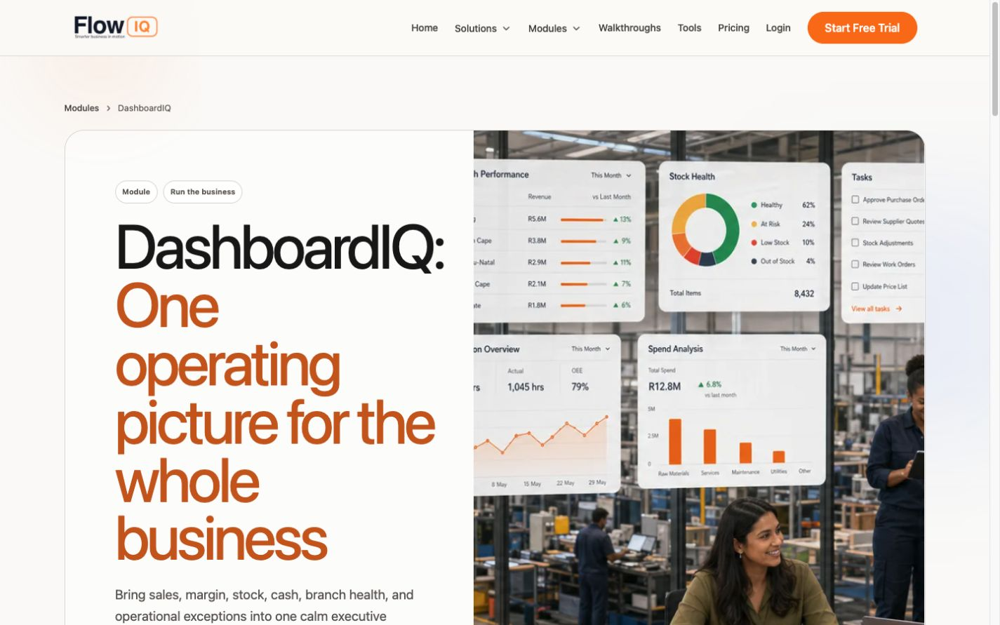
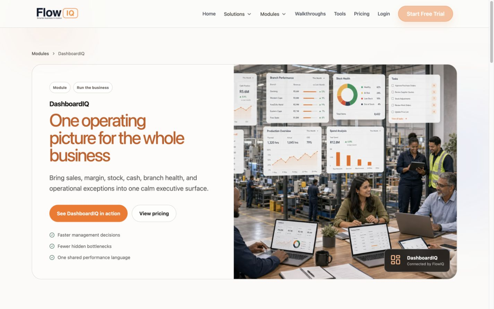
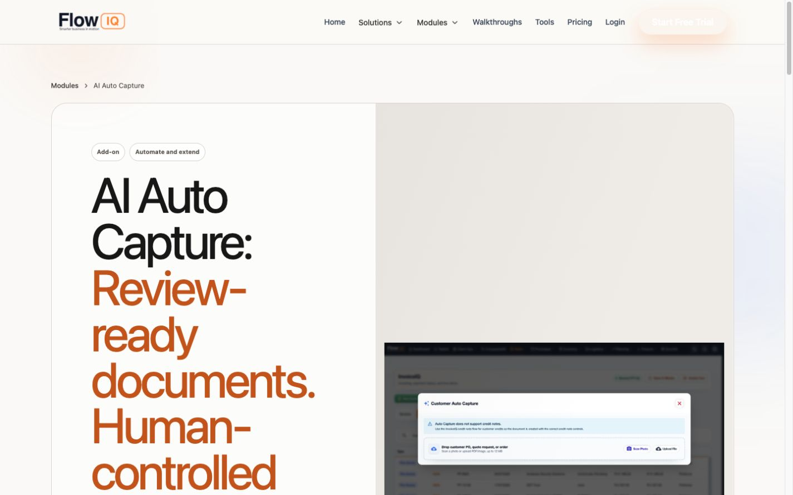
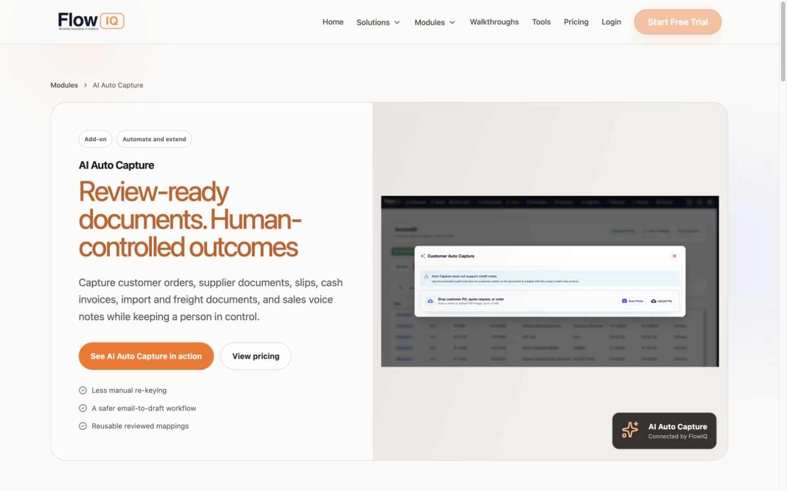
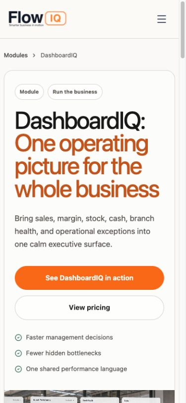
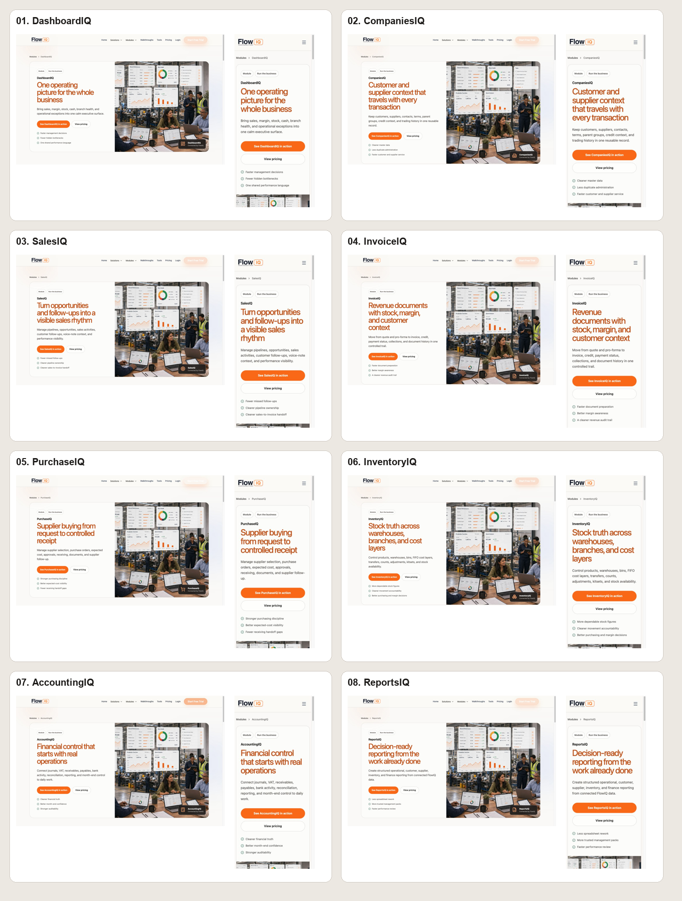
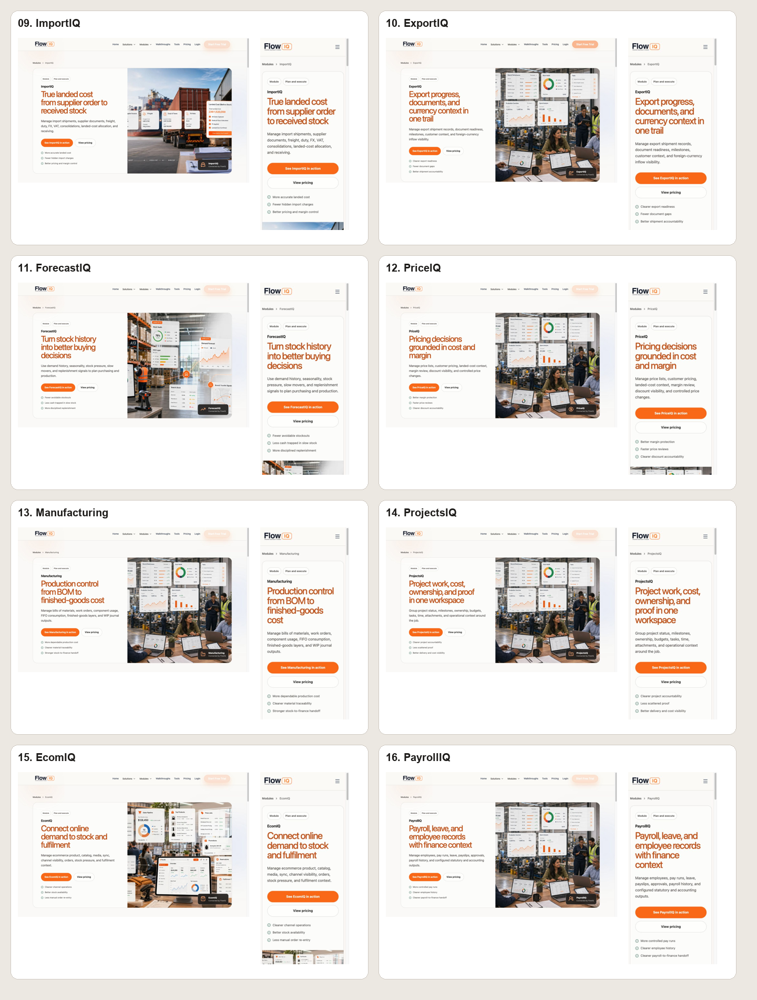
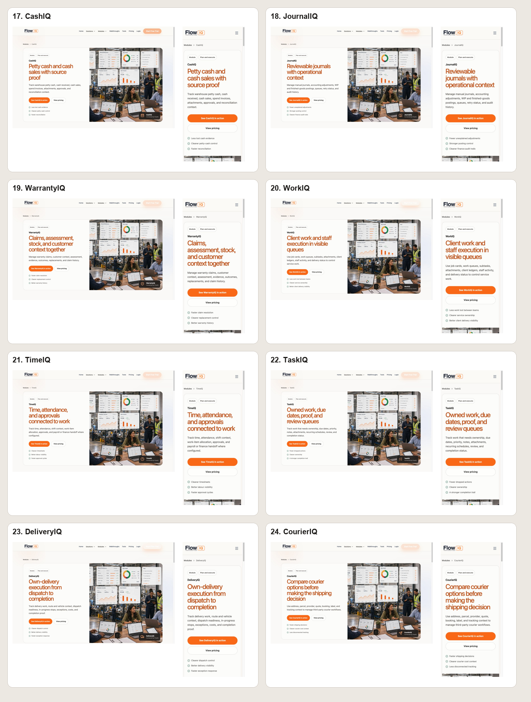
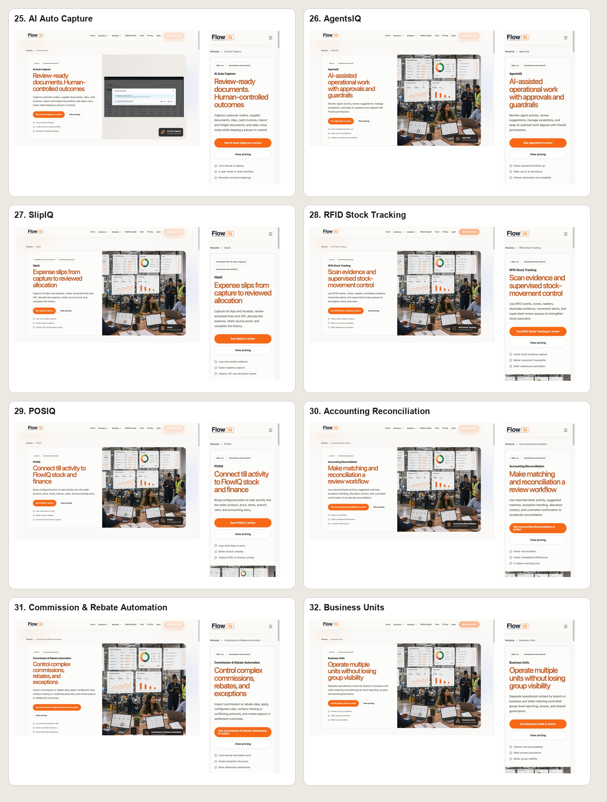

# Module Detail Page Visual Polish

**Date:** 2026-07-27  
**Property:** FlowIQ marketing website (`flowiq_website`)  
**Release state:** Implemented and locally verified; not deployed

## Outcome

All 32 generated module-detail pages now use a calmer, more deliberate hero
hierarchy. The module name reads as a compact product identifier, while the
buyer outcome remains the main headline at a controlled size.

The shared fix preserves the existing warm-paper, graphite, copper, emerald,
rounded-card, and real-product-imagery system. It does not change page claims,
URLs, SEO metadata, structured data, analytics, CTAs, or the canonical module
catalog.

## Combined UX and accessibility audit

### Scope and user goal

The audit covered the longest representative module heroes at 1440x900 and the
DashboardIQ hero at 390x844. The user goal is to understand a module's outcome
and reach its primary conversion actions without the heading overwhelming the
first viewport.

### Step 1: DashboardIQ desktop - poor before, healthy after

Before:

After:

- Before, the 89px title occupied about 504px vertically and stretched the hero
  to about 1,018px.
- After, the product name and outcome have separate visual roles, the title is
  about 186px high, and the hero is about 626px high.
- The summary, two actions, and outcomes remain visible without horizontal
  overflow.

### Step 2: AI Auto Capture desktop - poor before, healthy after

Before:

After:

- A later generic CSS rule overrode the page's intended smaller title size.
- Before, the title was about 671px high and the hero about 1,186px high.
- After, the long outcome fits in about 186px and the hero is about 657px high.
- The review-first screenshot and trust-oriented outcomes remain clear.

### Step 3: DashboardIQ mobile - acceptable before, healthy after

Before:

After:

- The mobile page keeps one semantic H1 and the original reading order.
- The module identifier no longer competes with the outcome headline.
- Buttons remain full-width and the page has no horizontal overflow.
- Screenshot evidence supports reflow and visible hierarchy, but keyboard,
  screen-reader, zoom, and contrast compliance still require dedicated testing.

## Complete 32-page visual sweep

Every generated module page was captured at 1440x900 and 390x844 after the
final shared styling changes. The four contact sheets pair the desktop and
mobile first viewport for each page:

The final sweep covered 64 captures and confirmed:

- all 32 desktop heroes are between 626px and 751px high;
- all 32 mobile heroes are between 940px and 1,013px high, including their
  stacked 304px product-image area;
- no horizontal or copy-container overflow;
- desktop columns remain separated and mobile content remains stacked;
- all hero images loaded;
- all primary actions remain visible and contained;
- the longest mobile H1 is 198px high.

The first sweep identified Commission & Rebate Automation as the only remaining
desktop outlier. Its outcome now uses a narrowly scoped compact size, reducing
the final hero below the 760px review threshold without changing its content.

## Implementation

- `tools/generate-module-marketing.mjs` owns the semantic H1 markup and CSS
  version.
- `assets/css/modules-marketing.css` owns the shared desktop, section-heading,
  and mobile scale.
- `tools/validate-module-marketing.mjs` checks the generated module-specific H1
  contract.
- `npm run generate:modules` synchronized all 32 detail pages.

## Validation

- `npm run generate:modules`
- `npm run validate:modules`
- `node --check tools/generate-module-marketing.mjs`
- `node --check tools/validate-module-marketing.mjs`
- Local HTTP render on `127.0.0.1:3333`
- Browser DOM and screenshot inspection at 1440x900 and 390x844
- Automated layout-metric and screenshot review of all 32 pages at both
  viewports
- No horizontal overflow on any final desktop or mobile capture
- No page-specific browser errors; the existing Tailwind CDN production warning
  remains and was not expanded into this visual-only change

## Regression risk

No identified regression risk exceeds 10%. The change is shared by design but
contained to generated module-detail markup and its dedicated stylesheet.
Automated validation covers all 32 pages, while representative long-title pages
were visually inspected on desktop and mobile.

## Release boundary

No Netlify deployment, Git push, commit, database change, or application/admin
console change was performed.
